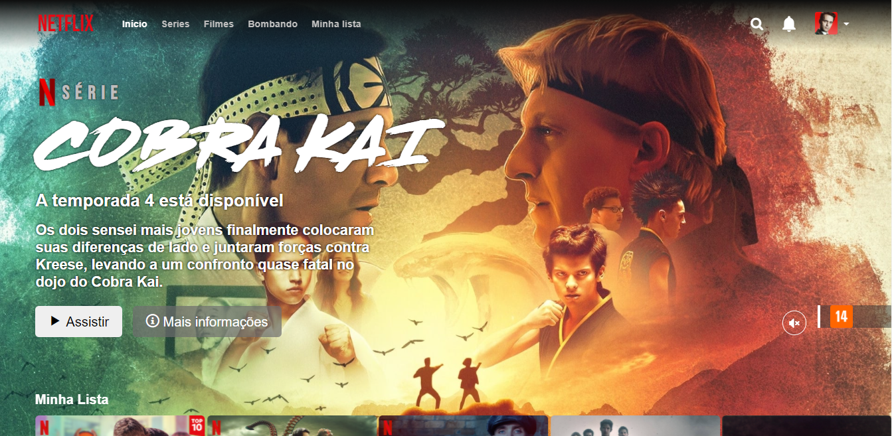

# Netflix Clone - Jquery

  

## Um pouco do Projeto:

➡ Um projeto na tentativa de fazer um clone do site da Netflix a partir do projeto feito na Digital Innovation One utilizando o framework Jquery para fazer o carrosel do site.

➡ Como não existia uma precisão perfeita nas distâncias, tamanhos e todas as medidas do site tive que fazer todas no olho e as imagens foram tiradas do próprio site da netflix.

➡ Ainda não possui interatividade nenhuma, apenas o visual

## Conteúdos

- [Overview](#overview)
  - [Como rodar o projeto](#como-rodar-o-projeto)
  - [Como utilizar](#como-utilizar-o-projeto)
  - [Screenshot](#screenshot)
  - [Links](#links)
- [Processo](#processo)
  - [Tecnologia utilizadas](#tecnologias-utilizadas)
  - [O que eu aprendi](#oque-eu-aprendi)
  - [Continuação do desenvolvimento](#continuacao-do-desenvolvimento)
- [Autor](#autor)

## Overview

### Como rodar o projeto

 1. Primeiramente é necessário ter o node js instalado(caso não tenha, apenas baixe a pasta zip do projeto) 
 2. Clone o projeto com `git clone https://github.com/glsvitoria/netflix-clone`
 3. Após clonar o projeto, basta apenas abrir o html principal do site e utilizar as suas funcionalidades

### Como utilizar

 1. Apenas visualizar as similaridades do site original: [Netflix](https://www.netflix.com/browse) com o clone feito por mim
 2. Pode-se também passar entre as séries já adicionadas ao carrosel do site

### Screenshot

### Links
- Site hospedado: [Netflix-Clone](link)

## Processo

### Tecnologias utilizadas:

### O que eu aprendi
 - Utilização do framework Jquery para colocar um carrosel
 - Posicionamento melhor dos itens usando o position absolute
 - Pegar imagens no próprio site da Netflix pelo inspecionar elemento

### Continuação do desenvolvimento
 - Colocar a interatividade do site para o menu de usuário
 - Adicionar a navbar escondida para o site responsivo que só aparece ao ser clicado

## Autor
- Linkedin - [Guilherme Vitória](https://www.linkedin.com/in/glsvitoria/)
- GitHub - [glsvitoria](https://github.com/glsvitoria)
- Instagram - [glsvitoria](https://www.instagram.com/glsvitoria/)
